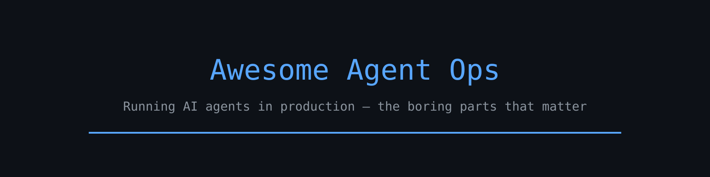

# Awesome Agent Ops

_English version: [README.md](README.md)_

  

Список о том, что на самом деле нужно, чтобы **личный ИИ-агент работал в проде**: не трюки с
промптами, а скучный слой — расписания, бюджет контекста, секреты, песочницы, доставка и те
поломки, о которых никто не предупреждает.

Всё здесь написано с агента, который работает без присмотра с середины 2026 года на одном
небольшом сервере: кроны в 03:10, Telegram, медицинские данные, почта и GitHub. Практические
заметки ссылаются на серию из 34 модулей, где каждая тема разобрана целиком:
[Hermes-Agent-Ops](https://github.com/ipanalytics/Hermes-Agent-Ops).

## Содержание

1. [Начните с поломок](#1-начните-с-поломок)
2. [Работа по расписанию](#2-работа-по-расписанию)
3. [Контекст и деньги](#3-контекст-и-деньги)
4. [Изоляция и секреты](#4-изоляция-и-секреты)
5. [Доставка и внимание](#5-доставка-и-внимание)
6. [Память, которая не гниёт](#6-память-которая-не-гниёт)
7. [Следить за машиной, а не только за моделью](#7-следить-за-машиной-а-не-только-за-моделью)

## 1. Начните с поломок

- **[Задача отработала и промолчала](https://github.com/ipanalytics/Hermes-Agent-Ops/tree/main/28-digest-delivery-health)** — крон, который падает тихо, хуже того, который падает громко. Доставляемость — это метрика, а не
  надежда. . *(delivery, cron)*

- **[Задача перестала существовать](https://github.com/ipanalytics/Hermes-Agent-Ops/tree/main/30-schedule-audit)** — расписания дрейфуют: одноразовый крон не перевзвёлся, задание «на день» стоит с марта. Проверять
  надо расписание, а не выпуск. . *(cron, publishing)*

- **[Отчёт, который никто не прочитал](https://github.com/ipanalytics/Hermes-Agent-Ops/tree/main/12-topic-routing)** — выпуск не в тот топик равен невыпуску. Разводить по смыслу, а не по привычке. . *(delivery,
  routing)*

- **[Контекст, который тихо сжался](https://github.com/ipanalytics/Hermes-Agent-Ops/tree/main/31-compaction-effect-check)** — компакция незаметна, пока не вынесет нужную деталь. Сначала измерьте её цену. . *(context)*

## 2. Работа по расписанию

- **[Крон для кронов](https://github.com/ipanalytics/Hermes-Agent-Ops/tree/main/05-cron-of-crons)** — одно задание, чья единственная цель — заметить, что другое не запустилось. *(cron, observability)*

- **[Линтер свежих промптов](https://github.com/ipanalytics/Hermes-Agent-Ops/tree/main/07-fresh-prompt-linter)** — промпты гниют быстрее кода: ссылаются на задания, файлы и имена, которых уже нет. *(cron, evals)*

- **[Из LLM-задания в скрипт](https://github.com/ipanalytics/Hermes-Agent-Ops/tree/main/24-llm-to-script)** — лучший крон — это скрипт-сборщик плюс небольшой вызов модели в конце, а не петля агента. *(cron,
  cost)*

- **[Эвалы и вскрытие](https://github.com/ipanalytics/Hermes-Agent-Ops/tree/main/20-task-evals-and-autopsy)** — когда задание упало, восстановите, что оно видело, вместо повторного прогона наугад. *(evals)*

## 3. Контекст и деньги

- **[Управление расходами](https://github.com/ipanalytics/Hermes-Agent-Ops/tree/main/19-cost-governance)** — жёсткий бюджет с мягкой деградацией лучше неожиданного счёта. *(cost)*

- **[Дашборд расходов](https://github.com/ipanalytics/Hermes-Agent-Ops/tree/main/10-cost-dashboard)** — траты по заданиям и моделям, чтобы «агент подорожал» стало числом с причиной. *(cost,
  observability)*

- **[Слой размышления](https://github.com/ipanalytics/Hermes-Agent-Ops/tree/main/29-thinking-layer-cost)** — платите за рассуждение там, где решение, а не там, где текст. *(cost, routing)*

- **[Компакция без пересказа](https://github.com/ipanalytics/Hermes-Agent-Ops/tree/main/31-compaction-effect-check)** — альтернатива пересказу: удалить то, что устарело, остальное оставить дословно. *(context, cost)*

## 4. Изоляция и секреты

- **[Ограничители инструментов](https://github.com/ipanalytics/Hermes-Agent-Ops/tree/main/15-agent-tool-guardrails)** — белый список на инструмент плюс хук, который отказывает опасной форме до запуска. *(isolation,
  secrets)*

- **[Песочница без root](https://github.com/ipanalytics/Hermes-Agent-Ops/tree/main/04-role-profiles)** — proot, одно дерево на запись, домашний каталог вообще не примонтирован. *(isolation)*

- **[Сторож кошелька](https://github.com/ipanalytics/Hermes-Agent-Ops/tree/main/01-agent-wallet-guard)** — лимиты и рубильник, который не зависит от собственного суждения агента. *(secrets, isolation)*

- **[Публикация работы агента](https://github.com/ipanalytics/Hermes-Agent-Ops/tree/main/03-agent-ops-playbook)** — стоп-лист, который срабатывает до `git push`: «я не забуду проверить» — это не контроль.
  *(publishing, secrets)*

## 5. Доставка и внимание

- **[Голос, который приходит голосом](https://github.com/ipanalytics/Hermes-Agent-Ops/tree/main/13-voice-input-hypotheses)** — аудио-ответ должен приходить голосовым сообщением и в темпе, который человек выдержит. *(voice,
  delivery)*

- **[Обязательства по доставке](https://github.com/ipanalytics/Hermes-Agent-Ops/tree/main/28-digest-delivery-health)** — держите список того, что и когда должно быть доставлено, и проверяйте его, а не логи. *(delivery)*

- **[Маршрутизация по темам](https://github.com/ipanalytics/Hermes-Agent-Ops/tree/main/12-topic-routing)** — статус — в журнал, решения — человеку, а тревоги — туда, где их увидят. *(routing, delivery)*

- **[Тихие часы и частота](https://github.com/ipanalytics/Hermes-Agent-Ops/tree/main/03-agent-ops-playbook)** — дайджест, который приходит, когда его не читают, приучает игнорировать дайджесты. *(delivery)*

## 6. Память, которая не гниёт

- **[Память по темам](https://github.com/ipanalytics/Hermes-Agent-Ops/tree/main/09-ops-as-data)** — маленькое ядро, всегда загруженное, плюс файл на каждую тему, читаемый по требованию. *(memory)*

- **[Гигиена сессий](https://github.com/ipanalytics/Hermes-Agent-Ops/tree/main/08-session-housekeeping)** — сессия — это лог, а не картотека: назвать, заархивировать, подрезать. *(memory, context)*

- **[Уборщик библиотеки навыков](https://github.com/ipanalytics/Hermes-Agent-Ops/tree/main/34-skill-library-janitor)** — навыки накапливаются, противоречат друг другу и описывают переименованные инструменты. *(memory,
  evals)*

- **[Аудит слепых зон](https://github.com/ipanalytics/Hermes-Agent-Ops/tree/main/21-blind-spot-audit)** — спросите, на что агент не смотрит; ответ обычно полезнее сводки. *(evals, observability)*

## 7. Следить за машиной, а не только за моделью

- **[Супервизор шлюза](https://github.com/ipanalytics/Hermes-Agent-Ops/tree/main/02-agent-gateway-supervisor)** — процесс, который говорит с мессенджером, — единственная точка отказа. *(observability, isolation)*

- **[Пробы стенда](https://github.com/ipanalytics/Hermes-Agent-Ops/tree/main/18-harness-probes)** — синтетические проверки всего пути: модель, инструмент, транспорт, права. *(observability, evals)*

- **[Операции как данные](https://github.com/ipanalytics/Hermes-Agent-Ops/tree/main/09-ops-as-data)** — каждая задача пишет строку; дашборд — это запрос, а не воспоминание. *(observability, datasets)*

## Чем этот список не является

- Не про промпт-инжиниринг. Это другая задача и другой список.
- Не фреймворк. Почти всё здесь — запись в кроне, скрипт и JSON-файл.
- Не закончен. Каждый пункт появился потому, что что-то сломалось.

## Как помочь

Правки и дополнения приветствуются — особенно **режимы отказа**: симптом, причина, лечение.
Одна строка на пункт, живая ссылка, без маркетинга.

## Лицензия

MIT для списка и для связанных модулей, если в модуле не сказано иное.
